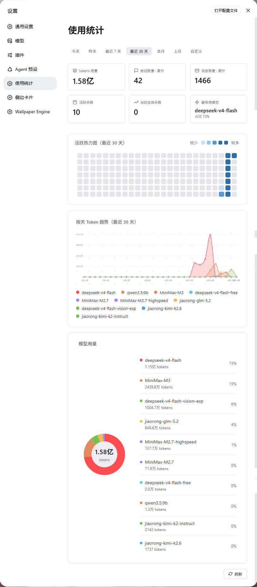
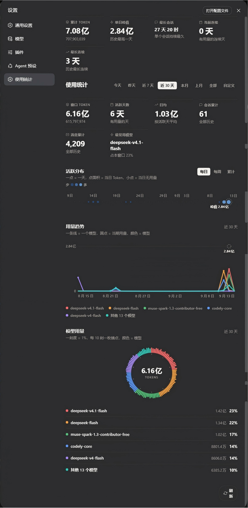

<p align="center"></p>

<div align="center">

#### DeepSeek Harness（DSH）插件：ZCode 风格的 Token 用量统计面板

**覆盖：全历史会话扫描 × 用量趋势 × 模型仪表盘 × 活跃热力图 × 深浅双主题**

[](https://git.io/typing-svg)

[](#-版本历史)
[](#-安装)
[](#-设计与实现)
[](#-许可与致谢)

</div>

---

一个装进 DSH 设置页的「Token 记账本」。扫描 `~/.dsh` 下的全历史会话，把每一枚 token 按天、按小时、按模型算清楚：今天写了多少、哪个模型最费、哪天是巅峰。**纯本地扫描、本地聚合、本地渲染**——数据不出本机。

> ⚠️ 非官方社区插件，与 DeepSeek / ZCode 无关联。"zcode" 仅为致敬对象与包名沿用。

## 📸 界面预览

| ☀️ 浅色主题 | 🌙 深色主题 |
|:---:|:---:|
|  |  |

## ✨ 功能特性

| 模块 | 说明 |
|------|------|
| 📅 **时间范围** | 今天 / 昨天 / 近 7 天 / 近 30 天 / 本月 / 上月 / 全部 / 自定义区间（起止自动校验防倒序） |
| 🔥 **活跃分布** | 日历点阵热力图：一格一天，点面积 = 当日 Token（sqrt 换算）；每日 / 每周 / 累计三档分桶；峰值日虚线圈标注 |
| 📈 **用量趋势** | 一条线一个模型，圆点 = 当期用量，峰值直接标数；悬停看各模型分项，图例可点击显隐 |
| 🍩 **模型用量** | 刻度环仪表盘：100 刻 = 100%，每 10 刻一枚锚点；扇形命中区悬停查看模型明细；模型超过 6 个自动并「其他」防撞色 |
| 🧮 **顶部指标** | 累计 Token / 单日峰值 / 最长会话时长 / 当前连续天数 / 最长连续天数 |
| ♿ **无障碍与体验** | WCAG AA 对比度（明暗双主题逐项核算）、`prefers-reduced-motion` 降级、透明命中层让小点也轻松悬停、深浅主题跟随 DSH |

## 📦 安装

前置：已安装 `@deepseek-ai/dsh`（及 DSH 插件命令依赖的 `pnpm`）。

```bash
dsh plugin --profile web add zcode-usage-stats
```

安装后重启 DSH 进程，打开 **设置 → 使用统计** 即可看到统计页面。

## 🚀 使用

- 顶部切换时间范围；**「全部」**显示自使用以来的所有数据。
- 趋势图悬停查看各模型分项，点击图例显隐对应模型。
- **「刷新」**强制重新扫描全部会话。

## ⚙️ 工作原理

```
~/.dsh 会话文件
        │
        ▼  sessionPersistence 全量枚举 + 回放事件
按天 / 按小时 / 按模型聚合 ──► 内存 + 磁盘双层缓存（SWR）
        │
        ▼
GET /api/usage-stats（过宿主信任栅栏：Host/Origin + cookie）
        │
        ▼
设置页前端：手写 SVG 按实测容器宽度 1:1 出图
```

## 🎨 设计与实现

| 设计点 | 说明 |
|--------|------|
| **图表** | 手写 SVG（日历点阵 / 发丝折线 / 刻度环），零运行时图表库依赖 |
| **配色** | 自研双轨色板：类目色 6 个跨色相承载模型身份，序数色单色相明度阶承载用量大小；两套主题均满足 WCAG AA，类目色两两色距核算保证一眼可分 |
| **排版** | 固定 px 字阶 + 4 的倍数间距阶梯；图表按 ResizeObserver 实测容器宽度 1:1 出图，不做等比缩放，字号真实可读 |
| **命中区** | 视觉元素不绑事件：热力图逐格透明矩形、刻度环整圈扇形 path，悬停不闪烁 |
| **服务端** | 复用宿主 `sessionPersistence` 聚合；内存 + 磁盘双层缓存，SWR 过期后台刷新，首屏不因全量扫描卡顿 |
| **安全** | `/api/usage-stats` 自行通过宿主 `connection.requestRejection` 信任栅栏鉴权 |

## 🔢 数据口径

| 指标 | 口径 |
|------|------|
| Token 用量 | 以 `assistant/message` 事件携带的全量 `usage` 为准（input + output + cacheRead + cacheWrite），按 `turn:step` 去重防重复计数 |
| Turns | 以 `step/end` 事件按新 turn 计数（覆盖 completed / failed / cancelled） |
| 模型归属 | 优先取消息自身 `model`，回退 `request/context` 当前模型，再回退归并为 `other` |
| 活跃日 | 当天有 ≥1 条 usage 事件；连续天数按活跃日相邻日推算 |

## 🤝 兼容性

- 针对 DSH 开发者预览版开发，锁定 `@deepseek-ai/dsh >= 0.1.0-rc.5`。
- 依赖 DSH 宿主提供的 `sessionPersistence`、`webServer`、`connection` 服务，以及客户端运行时 `@deepseek-ai/dsh-client-runtime`、`@deepseek-ai/dsh-client-ui-slots`。

## 🗂️ 仓库结构

<details>
<summary><b>目录树</b>（点击展开）</summary>

```
zcode-usage-stats/
├── package.json          # 插件清单（dsh 客户端注入声明）
├── cordis.patch.yml      # DSH 补丁声明
├── LICENSE               # MIT
├── README.md             # 本文件
├── assets/
│   ├── usage-stats.png   # 浅色主题截图
│   └── usage-stats2.png  # 深色主题截图
└── lib/
    ├── index.mjs         # 宿主侧：扫描全历史会话 + 聚合 + 双层缓存 + API
    └── client.js          # 前端：设置页界面 + 手写 SVG 图表
```

</details>

## 📜 版本历史

<details>
<summary><b>当前 v0.1.0</b>（2026-09-13）· 初始开源版本</summary>

| 版本 | 内容 |
|------|------|
| v0.1.0 | 初始开源版本：以 [qianxiao1213/zcode-usage-stats](https://github.com/qianxiao1213/zcode-usage-stats) 原版为基线，重写全部图表界面与配色（活跃分布 / 用量趋势 / 模型用量三图 + 自研双轨色板），补齐双主题截图与文档 |

</details>

## 🙏 许可与致谢

- 代码以 **MIT License** 发布，见 [LICENSE](LICENSE)。
- 上游致谢：基于 [qianxiao1213/zcode-usage-stats](https://github.com/qianxiao1213/zcode-usage-stats) 重构——图表界面与配色全部重写，数据聚合层在其基线上演进。
- 本插件为非官方社区项目，与 DeepSeek / ZCode 无关联。

<div align="center">

---

Made by [@Amer-CN](https://github.com/Amer-CN)

*数据只在本机算，哪也不去。*

</div>
